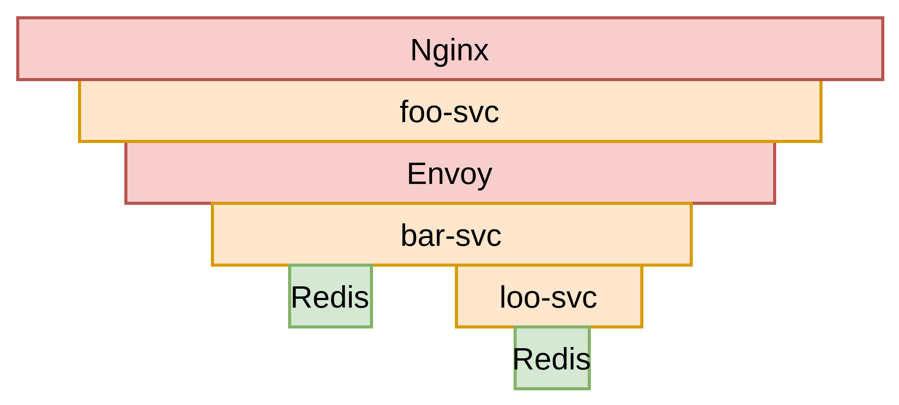
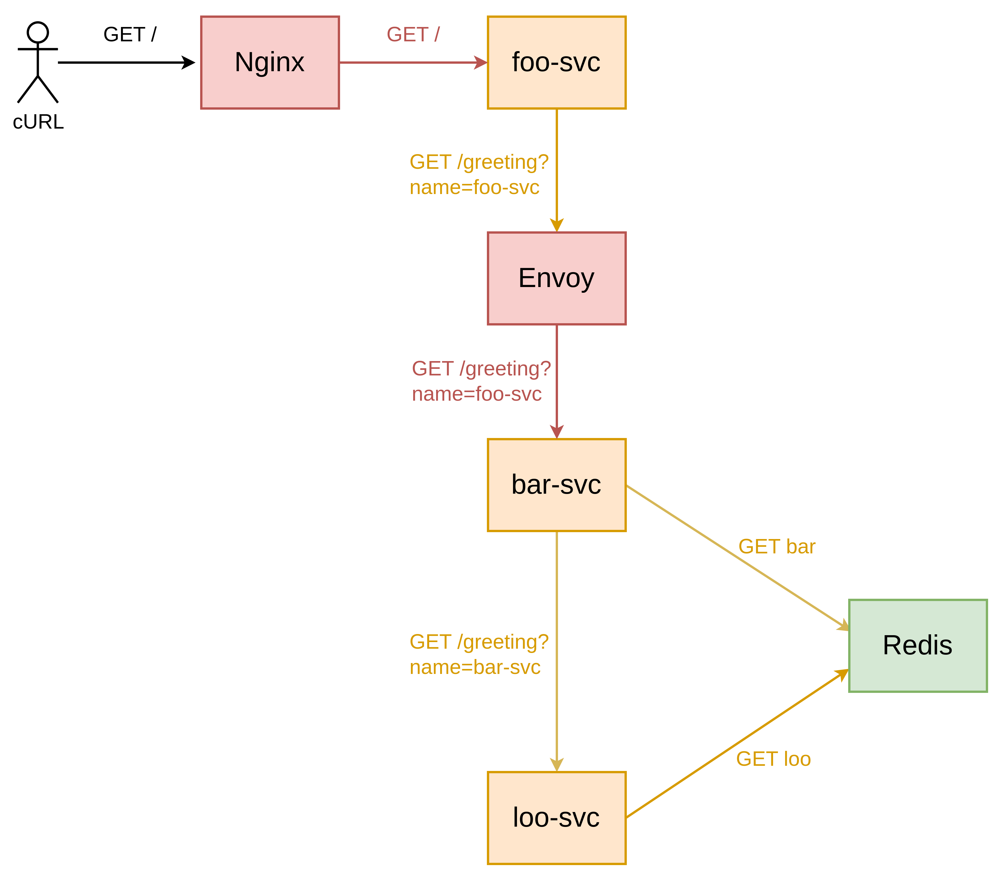

# spring distributed tracing demo

Spring Boot 项目利用 Jaeger 做分布式追踪的示例。

## 项目介绍

这个项目一共有三个 spring service，分别是 `foo-svc`、`bar-svc`、`loo-svc`。有两个
proxy，分别是 `Nginx`、`Envoy`。有一个 `Redis` 数据库。

调用关系：

1. 用户请求 `Nginx`
2. `Nginx` 调用 `foo-svc`
3. `foo-svc` 调用 `Envoy`
4. `Envoy` 调用 `bar-svc`
    1. `bar-svc` 调用 `Redis`
    2. `bar-svc` 调用 `loo-svc`
        1. `loo-svc` 调用 `Redis`
5. `Jaeger` 追踪 `foo-svc`、`bar-svc`、`loo-svc`。

追踪火焰图：


服务拓补图：


## Docker 运行环境

**部署**

1. 切到
   deploy/docker，执行：`docker-compose up -f docker-compose_with_proxy.yaml -d`。
2. 访问 Nginx：`curl http://localhost:80`。
3. 查看 Jaeger：[http://localhost:16686/](http://localhost:16686/)。

## K8s 运行环境

**部署**

1. 切到 deploy/k8s，执行：`kubectl apply all-in-one.yaml`。
2. 使用 `kubectl port-forward` 转发 8080 和 16686 端口到本地。
3. 访问 foo-svc：`curl http://127.0.0.1:8080`。
3. 查看 Jaeger：[http://localhost:16686/](http://localhost:16686/)。

**推拉镜像**

容器镜像服务可以选用私仓，我使用 `registry.cn-beijing.aliyuncs.com`。

```sh
cd foo-svc/
docker build . -t registry.cn-beijing.aliyuncs.com/obser/foo-svc:latest
docker push registry.cn-beijing.aliyuncs.com/obser/foo-svc:latest
```

推拉镜像可能需要 `kubernetes.io/dockerconfigjson` 类型的凭证。

## 环境变量

本项目提供了几个环境变量，你可以根据自己的实际情况修改

| Environment Variable             | Default Value         | Belong Service      | Description |
|----------------------------------|-----------------------|---------------------|-------------|
| `BAR_SVC_URL`                    | `http://bar-svc:8080` | `foo-svc`           |             |
| `LOO_SVC_URL`                    | `http://loo-svc:8080` | `bar-svc`           |             |
| `SERVER_PORT`                    | `8080`                | all                 |             |
| `REDIS_HOST`                     | `redis`               | `bar-svc` `loo-svc` |             |
| `REDIS_PORT`                     | `6379`                | `bar-svc` `loo-svc` |             |
| `JAEGER_UDP_SENDER_HOST`         | `localhost`           | all                 |             |
| `OPENTRACING_SPRING_WEB_ENABLED` | `true`                | all                 | 是否为spring web开启opentracing |

## 参考

* [OpenTracing Java][opentracing-java]
* [OpenTracing java-spring-jaeger][opentracing java-spring-jaeger]
    * [OpenTracing java-spring-web][opentracing java-spring-web]
    * [OpenTracing java-spring-cloud][opentracing java-spring-cloud]
* [OpenTracing java instrumentation][opentracing java]
* [OpenTracing Tutorial - Java][opentracing-tutorial-java]

[k8s-learn-istio-install]: https://github.com/chanjarster/k8s-learn/tree/master/addons-guide/istio/install

[opentracing java-spring-jaeger]: https://github.com/opentracing-contrib/java-spring-jaeger

[opentracing java-spring-web]:https://github.com/opentracing-contrib/java-spring-web

[opentracing java-spring-cloud]:https://github.com/opentracing-contrib/java-spring-cloud

[opentracing java]: https://github.com/opentracing-contrib?utf8=%E2%9C%93&q=&type=&language=java

[opentracing-tutorial-java]: https://github.com/yurishkuro/opentracing-tutorial/tree/master/java

[istio-issue-7963]: https://github.com/istio/istio/issues/7963

[opentracing-java]: https://github.com/opentracing/opentracing-java

[opentracing java-redis-client]: https://github.com/opentracing-contrib/java-redis-client

* [Pull an Image from a Private Docker Registry | Kubernetes](https://kubernetes.io/docs/tasks/configure-pod-container/pull-image-private-registry/)
